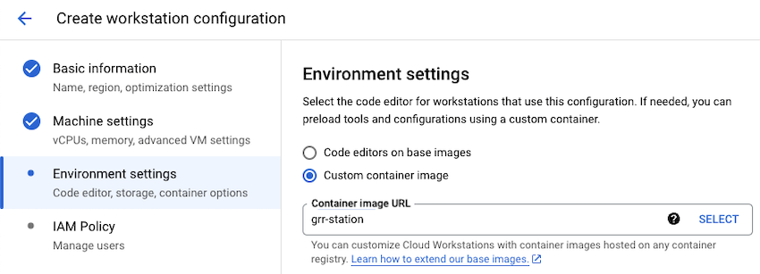

# Creating a GRR Workstation - Code OSS based development environment

## Introduction

This document covers how you can create a GRR (Cloud) Workstation [container image](https://cloud.google.com/workstations/docs/customize-container-images) with a Code OSS based development environment that you can run either as a [Google Cloud Workstation](https://cloud.google.com/workstations/docs/overview) or locally on your computer in case you have Docker installed.

Follow the instructions below to:
1. Build the container image,
2. Run the container image as a Cloud Workstation on Google Cloud, or
3. Run the container image on your computer locally.

## 1. Building the GRR Workstation container image

The GRR Workstation consist of a container image that bundles the Code OSS development environment, the GRR source code repo, the codelabs and some useful tooling that you can leverage when working on the GRR source code.
Refer to the online documentation for more background about [Google Cloud Workstations](https://cloud.google.com/workstations/docs/overview) and how to build a [customised container image](https://cloud.google.com/workstations/docs/customize-container-images).

The ```Dockerfile``` in this directory contains all the instructions to build your own container image.

To build the GRR Workstation container image rund the command below:

```
docker build -t grr-station .
```

Note
* The Cloud Workstation setup takes advantage of mounting a [Cloud Firestore](https://cloud.google.com/filestore/docs/overview) shared (NFS) directory that can be used for sharing files between workstations (i.e. for convenient collaboration between team members).
* The setup works fine without that shared Cloud Filestore directory in case you do not require that feature you need to do nothing extra.
* However, in case you want to take advantage of the shared directory then follow the instructions in the [Cloud Filestore online documentation](https://cloud.google.com/filestore/docs/creating-instances) to get a Filestore created that can be mounted into the Cloud Workstations.
* Make sure you set the following two environment variables when you [create your workstation configuration](https://cloud.google.com/workstations/docs/create-configuration).
 * ```FILESTORE_INSTANCE_IP: xxx.xxx.xxx.xxx```
 * ```FILESTORE_SHARE_NAME: workstations```

## 2. Run the GRR Workstation on Google Cloud

Refer to the [Google Cloud online documentation](https://cloud.google.com/workstations/docs/quickstart-set-up-workstations-console) for how to set up workstation clusters, workstation configuration, and workstation. Check the prerequisites [before you begin](https://cloud.google.com/workstations/docs/quickstart-set-up-workstations-console#before-you-begin), and then follow these steps:

1. [Create a workstation cluster](https://cloud.google.com/workstations/docs/quickstart-set-up-workstations-console#create_a_workstation_cluster)
2. [Create a workstation configuration](https://cloud.google.com/workstations/docs/quickstart-set-up-workstations-console#create_a_workstation_configuration), make sure you select your ```grr-station``` container image when you create your configuration.



3. [Create and launch a workstation](https://cloud.google.com/workstations/docs/quickstart-set-up-workstations-console#create_and_launch_a_workstation)

## 3. Run the GRR Workstation locally

In case you would like to run the GRR Workstation on your computer locally you can do so with the command below.

Please note that your mileage might vary depending on the spec of your machine.

```
docker run --rm -d --env='DOCKER_OPTS=' --volume=/var/lib/docker --privileged \
           --name grr-station -p 8080:80 -p 8000:8000 -p9090:9090 grr-station
```

You can now connect to the
- GRR Workstation by pointing your browser to [http://localhost:8080](http://localhost:8080)
- GRR itself by pointing your browser to [http://localhost:8000](http://localhost:8000)
- Codelabs by pointing your browser to [http://localhost:9090](http://localhost:9090)
