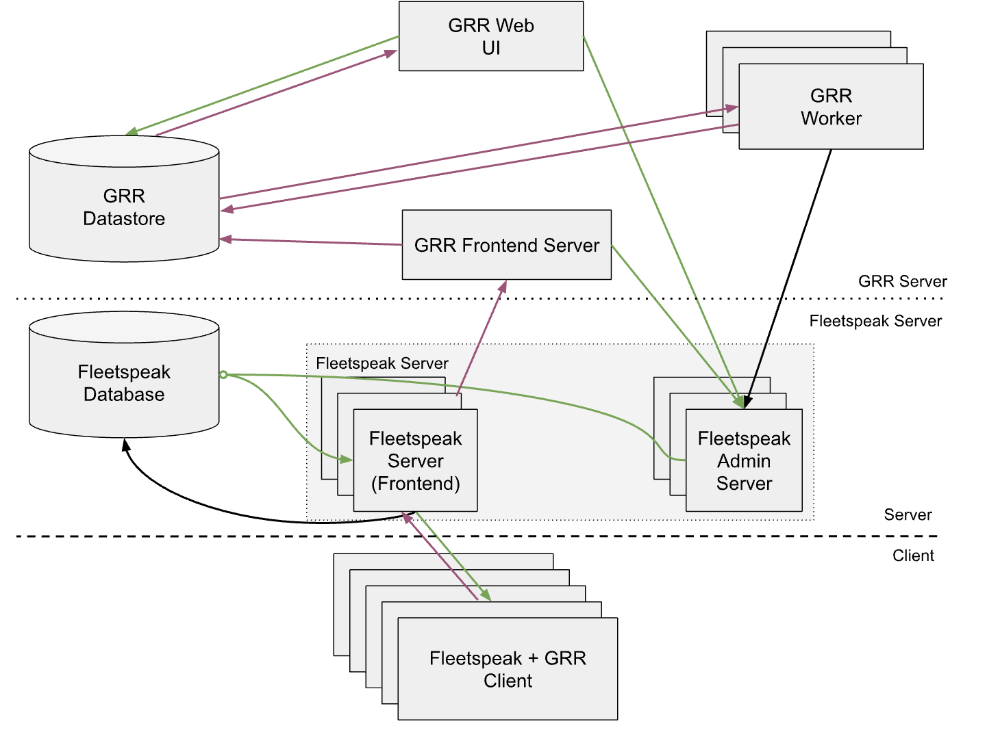

# Overview

Depending on your use case, there are multiple ways of installing the
GRR server components. Most users will want to
[run GRR via the docker compose stack](via-docker-compose.md).

Alternatively, GRR can be [installed from PIP](from-released-pip.md).

You can install also GRR from source as described
[here](from-source.md). You should then be able to modify GRR code and build
your own server/client installers.

## GRR components

GRR consists of a client and a few server components.

Whenever GRR server is installed using one of the methods mentioned above, all the server components are installed. This is a simple way to setup smaller GRR server installations: each component will run as a separate server process on the same machine. However, when scaling GRR server to run on multiple machines, each component can exist on its own machine in the data center and run separately.

GRR components are:

#### Client

The GRR client **is not a server component** but it comes bundled with GRR server. GRR client is deployed on corporate assets using the usual mechanism for software distribution and updates (e.g. SMS, apt). The client consists of 2 processes: the fleetspeak client responsible for implementig the communication protocol based on a streaming HTTPS connection. The GRR client process sends and receives GRR messages from the server and implements the business logic.

#### GRR Datastore
The data store acts both as a central storage component for data, and as a communication mechanism for all GRR server components.

#### Fleetspeak server

This component terminates the streaming HTTPS connections from the fleetspeak clients and implements the communication protocol. It receives messages from clients and delivers queued messages to the clients.

#### Fleetspeak admin server

This component provides an interface for the GRR server to send messages to clients.

#### Fleetspeak database

The fleetspeak system uses a MySQL database for queing messages for clients.

#### GRR Front End Servers
The front end servers' main task is to receive GRR messages from the fleetspeak server, un-bundle the contained messages and queue these on the data store. The front end also fetches any messages queued for the client and sends them to the client.

#### GRR Worker
In order to remain scalable, the front end does not do any processing of data, preferring to offload processing to special worker components. The number of workers can be tuned in response to increased workload. Workers typically check queues in the data stores for responses from the client, process those and re-queue new requests for the clients (See Flows and Queues).

#### GRR Web UI
GRR Web UI is the central application which enables the incident responder or forensic analyst to interact with the system. It allows for analysis tasks to be queued for the clients, and results of previous stored analysis to be examined. It also acts as an API endpoint: GRR API can be used for automation and integration with other systems.

